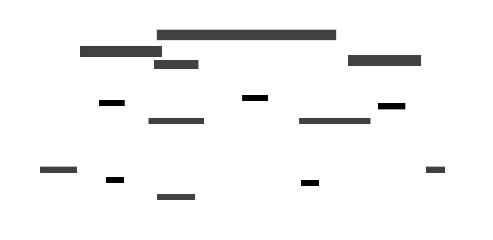

# OpenSearch Serverless Cross Account Setup

This is a sample CDK application to illustrate a cross account setup of [OpenSearch Serverless](https://docs.aws.amazon.com/opensearch-service/latest/developerguide/serverless.html) with private access through a [VPC endpoint](https://docs.aws.amazon.com/opensearch-service/latest/developerguide/serverless-vpc.html).
It allows you to ingest data from one AWS account to an OpenSearch Serverless collection in a different AWS account.

The setup is split in two accounts:
- **ingestion account:** a Lambda Function that ingests data from certain sources (DynamoDB, S3, ...) to an OpenSearch Serverless collection in a different account. The Lambda Function is placed in a VPC and assumes an IAM role in the search account to write data to the OpenSearch Serverless collection by leveraging a VPC endpoint.
- **search account:** an OpenSearch Serverless collection that allows [network access](https://docs.aws.amazon.com/opensearch-service/latest/developerguide/serverless-network.html) from a VPC endpoint and [data access](https://docs.aws.amazon.com/opensearch-service/latest/developerguide/serverless-data-access.html) for an IAM role.

## Deployment

The setup unfortunately requires step-wise deployments because the resources have cyclic dependencies.
Look at [bin/main.ts](bin/main.ts) which contains comments explaining which fields you need to set.
Here's a general overview:

1. Deploy the `IngestionStack` to create the Lambda Function and a VPC endpoint
2. Note the VPC endpoint id of the stack output because it's required for the `SearchStack`.
3. Deploy the `SearchStack` to create the OpenSearch Serverless collection -> it requires a VPC endpoint id.
4. Note the collection id and IAM role ARN of the stack outputs because they are required for the Lambda Function of the ingestion stack.
5. Deploy the `IngestionStack` again with the updated parameters.

Now you can run the Lambda Function to test the connection and ingestion of data.

> ⚠️ This is a sample application. You might want to further restrict permissions of the VPC endpoints, Lambda Function or OpenSearch Serverless collection. 

## Useful CDK commands

* `npm run build`   compile typescript to js
* `npm run watch`   watch for changes and compile
* `npm run test`    perform the jest unit tests
* `npx cdk deploy`  deploy this stack to your default AWS account/region
* `npx cdk diff`    compare deployed stack with current state
* `npx cdk synth`   emits the synthesized CloudFormation template

## Need help or have suggestions?

I'm a cloud consultant focusing on AWS and happy to help & learn. Just create an issue or [send me a message](mailto:hello@sh-cloud.software).
